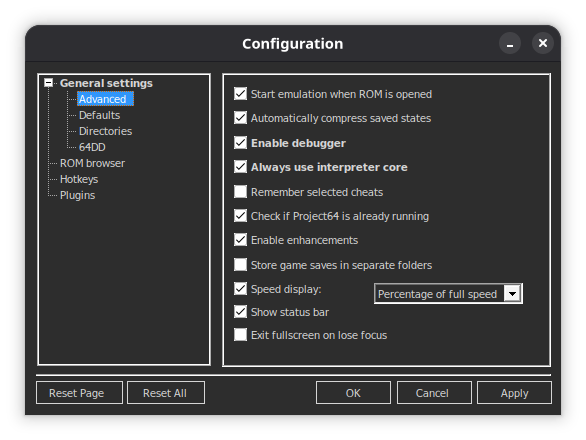
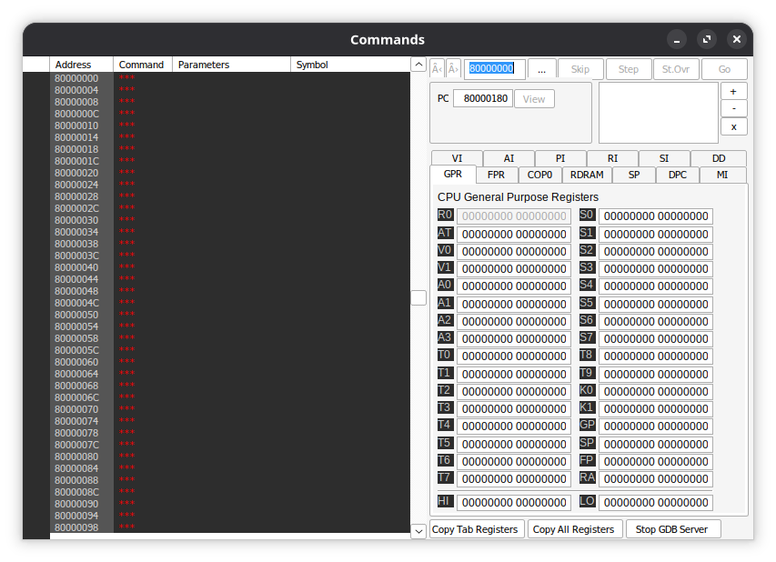
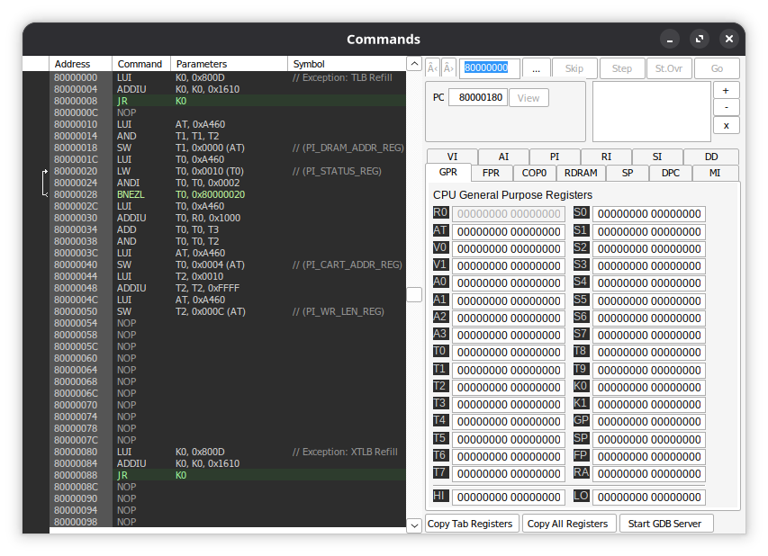
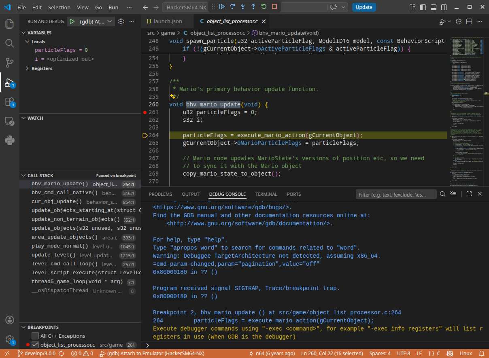
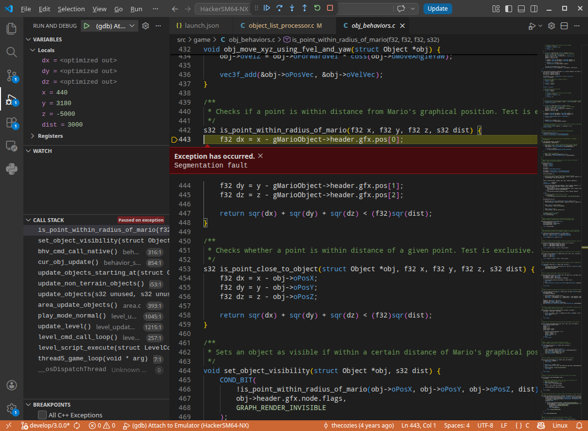

# How to use GDB with HackerSM64?

You will need the following tools:

* Emulator supporting GDB stub

    Luna Project64, at least version 3.6.2 or Ares will work. On Linux you can use wine.

* GDB

    For Windows you will need a special version of GDB called "gdb-multiarch". You can find prebuilt binaries [here](https://github.com/adamrehn/gdb-multiarch-windows/releases).

* Visual Studio Code

## ROM setup

In HackerSM64 `Makefile` make sure you have `-gdwarf-4` in CFLAGS. If `-gdwarf-4` was not present, you can add it to 
```
# C compiler options
CFLAGS = -G 0 $(OPT_FLAGS) $(TARGET_CFLAGS) $(MIPSISET) $(DEF_INC_CFLAGS) -gdwarf-4
```

Make sure to `make clean` + `make` to cleanly rebuild with debugging symbols on.

One way to check that symbols are enabled is to use `addr2line` tool.

```
addr2line -e ./build/us_n64/sm64.elf  0x80000400
./HackerSM64/src/buffers/buffers.c:27
```

We will present GDB with sm64.elf file for debugging.

## Emulator setup

I am assuming that you are using Luna Project64. In "Options" > "Configurations" > "Advanced" check options "Enable Debugger" and "Always use interpreter core".



Go to Debugger > Commands. Click "Start GDB Server". On Linux this window is glitchy so do not try to resize it.



Keep the "Commands" window opened. Open the ROM using File > Open ROM. Now you will have Commands window reflect the running ROM state.



## VSCode setup

Add the following file in `.vscode/launch.json`

```
{
    "version": "0.2.0",
    "configurations": [
        {
            "name": "(gdb) Attach to Emulator",
            "type": "cppdbg",
            "request": "launch",
            "program": "./build/us_n64/sm64.elf",
            "miDebuggerServerAddress": "127.0.0.1:9123",
            "cwd": "${workspaceFolder}",
            "MIMode": "gdb",
            "miDebuggerPath": "gdb", // update for Windows to point to gdb-multiarch.exe
            "setupCommands": [
                {
                    "description": "Enable pretty-printing for gdb",
                    "text": "-enable-pretty-printing",
                    "ignoreFailures": true
                }
            ]
        }
    ]
}
```

Click F5, this will launch GDB which will attach to emulator. You can now set the breakpoints in the code. For example I can set a breakpoint in `bhv_mario_update` and get VSCode to break in Mario update behavior.



You now have all the benefits of GDB debugging.

## Crash example

If your hack will crash, emulator will automatically trigger GDB and give it a first chance to see the exception. If I were to set `gMarioObject` to NULL
```
void bhv_mario_update(void) {
    gMarioObject = NULL; // this will eventually crash due to NULL deref
    u32 particleFlags = 0;
    s32 i;

    particleFlags = execute_mario_action(gCurrentObject);
    gCurrentObject->oMarioParticleFlags = particleFlags;
...
```

Perform a rebuild, reopen the ROM from "File" menu, make sure VSCode is attached to the emulator. Get past the file select menu and you will get "Segmentation Fault" exception.



You can observe the non-optimized locals, the call stack, walk down the stack. You can click "Continue" and get a crash screen inside the emulator as well.

Luna Project64 "Commands" window is also fully functional so if you want to read the assembly or use memory breakpoints.

Note that due to optimizations stepping might behave weirdly. You can use `__attribute__((optimize("O0")))` attribute to disable optimizations for a certain function you want to debug.
